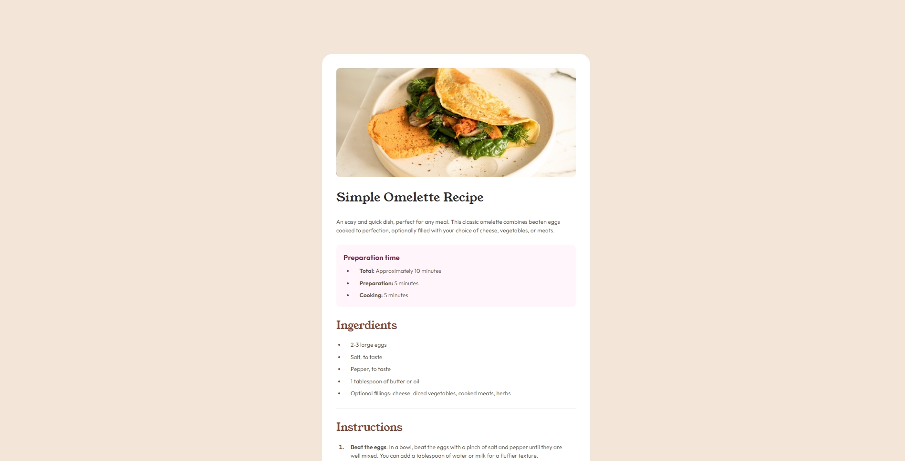

# Frontend Mentor - Recipe page solution

This is a solution to the [Recipe page challenge on Frontend Mentor](https://www.frontendmentor.io/challenges/recipe-page-KiTsR8QQKm). Frontend Mentor challenges help you improve your coding skills by building realistic projects. 

## Table of contents

- [Overview](#overview)
  - [Screenshot](#screenshot)
  - [Links](#links)
- [My process](#my-process)
  - [Built with](#built-with)
  - [What I learned](#what-i-learned)
  - [Useful resources](#useful-resources)
- [Author](#author)

## Overview

### Screenshot



### Links

- Solution URL: [https://github.com/dimitrimabom/recipe-page](https://github.com/dimitrimabom/recipe-page)
- Live Site URL: [https://recipe-page-ss7i.onrender.com](https://recipe-page-ss7i.onrender.com)

## My process

### Built with

- Semantic HTML5 markup
- CSS custom properties
- Flexbox
- SCSS

### What I learned

I've concentrated here on explaining how SCSS works. 

To initiate the SCSS packet, use the following command:

```bash
npm install -g sass
```

And so that the SCSS package continuously observes the **style.scss** file and converts it into CSS in the **style.css** file at the root of the project, use this command :

```bash
sass --watch style.scss style.css
```

### Useful resources

- [SCSS Docs](https://sass-lang.com/guide/) - Install Sass and learn out to use.

## Author

- Website - [Dimitri Mabom](https://github.com/dimitrimabom)
- Frontend Mentor - [@dimitrimabom](https://www.frontendmentor.io/profile/dimitrimabom)
- Linkedin - [Dimitri Mabom](https://www.linkedin.com/in/dimitri-mabom/)